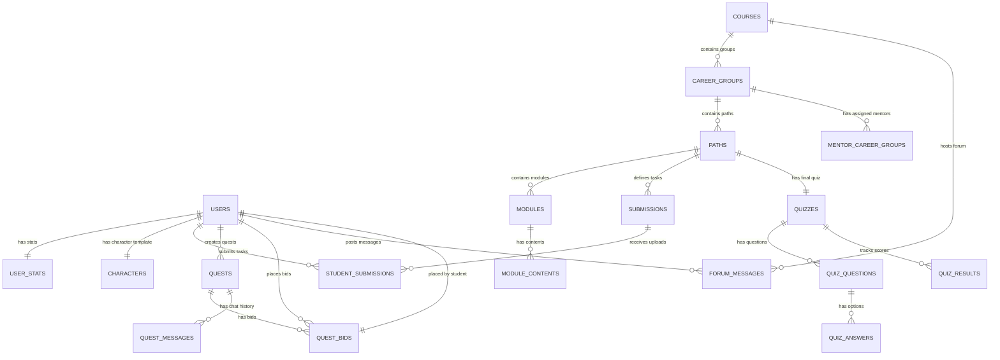
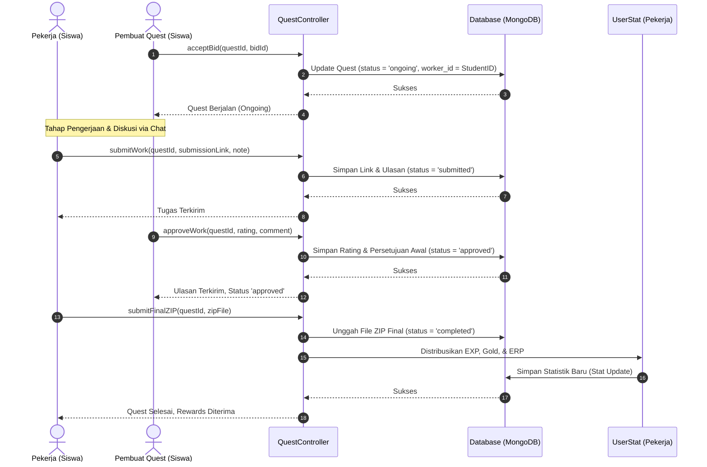
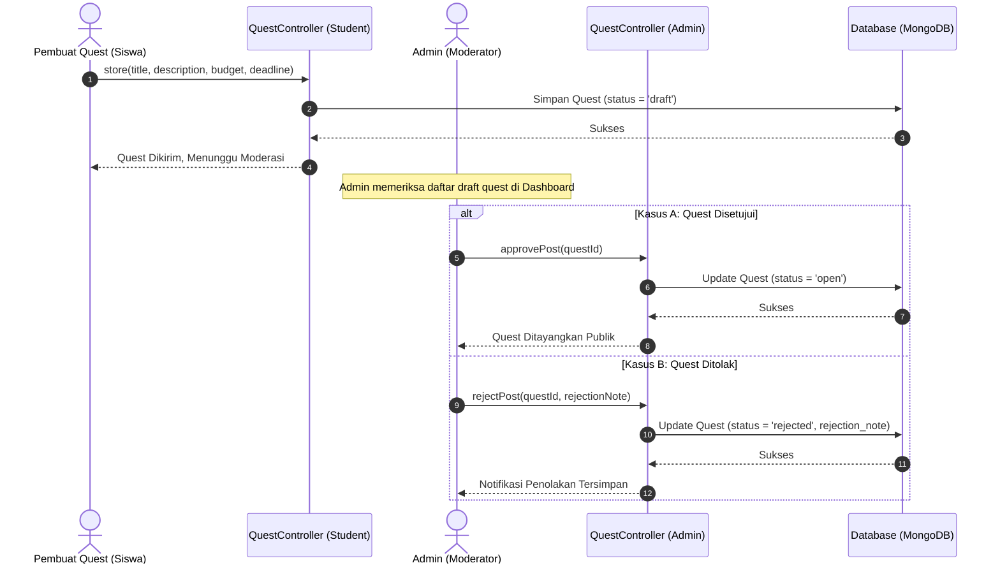
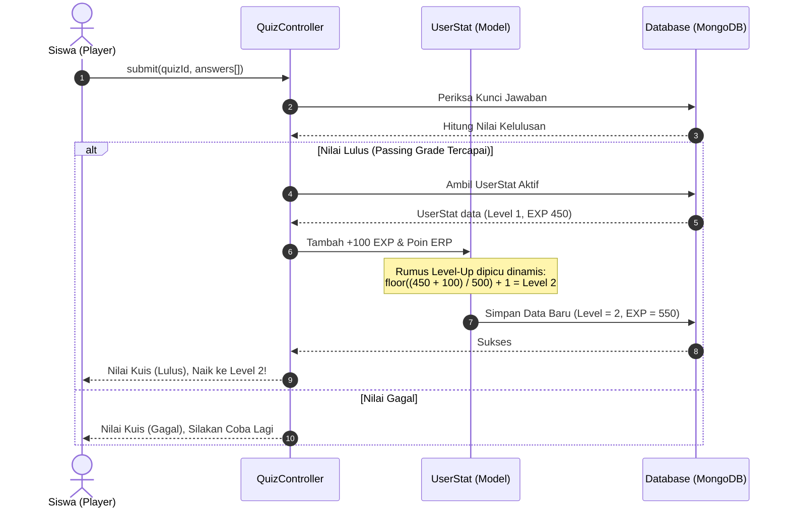
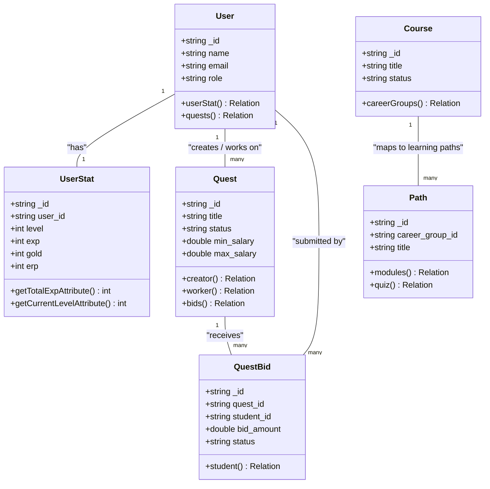

# Dokumentasi UML, ERD, & Sequence Diagram Sistem SkillMongo

Diagram-diagram di bawah menyajikan pemodelan visual lengkap untuk **SkillMongo**, termasuk Entity-Relationship Diagram (ERD), Use Case Diagram, Class Diagram, dan Sequence Diagram alur bisnis krusial.

---

## 1. Entity-Relationship Diagram (ERD)

Diagram di bawah menunjukkan hubungan antara koleksi MongoDB (diperlakukan sebagai entitas relasional melalui Eloquent ORM).

---

## 2. Use Case Diagram

Diagram ini mendefinisikan hak aksi (Use Cases) untuk masing-masing tipe aktor (Student, Mentor, Admin) di dalam ekosistem platform.

```mermaid
graph TB
    subgraph Aktor Utama
        S["Siswa (Student)"]
        M["Mentor"]
        A["Admin"]
    end

    subgraph Modul Autentikasi & RPG
        UC_SelectChar["Pilih Karakter Awal"]
        UC_Auth["Login / Registrasi / 2FA"]
    end

    subgraph Modul LMS & Belajar
        UC_ViewRoadmap["Lihat Peta Belajar / Roadmap"]
        UC_CompleteModule["Selesaikan Modul Konten"]
        UC_SubmitQuiz["Kerjakan Kuis MCQ"]
        UC_SubmitTask["Kirim Tugas Proyek"]
    end

    subgraph Modul Freelance Quest
        UC_PostQuest["Posting Quest Baru (Draft)"]
        UC_BidQuest["Bidding Quest (Kirim Proposal)"]
        UC_ChatQuest["Chat Koordinasi Pekerjaan"]
        UC_SubmitFinalZIP["Kirim ZIP Proyek Final"]
        UC_ApproveWork["Approve Hasil & Rilis Rewards"]
    end

    subgraph Modul Kurasi & Moderasi
        UC_ManageCourse["Kelola Kursus & Peta Belajar"]
        UC_GradeTask["Koreksi & Grade Tugas Siswa"]
        UC_ModQuest["Moderasi Post Quest (Approve/Reject)"]
        UC_ManageUsers["Kelola Pengguna & Hak Akses"]
    end

    S --> UC_Auth
    S --> UC_SelectChar
    S --> UC_ViewRoadmap
    S --> UC_CompleteModule
    S --> UC_SubmitQuiz
    S --> UC_SubmitTask
    S --> UC_PostQuest
    S --> UC_BidQuest
    S --> UC_ChatQuest
    S --> UC_SubmitFinalZIP

    M --> UC_Auth
    M --> UC_GradeTask
    M --> UC_ManageCourse

    A --> UC_Auth
    A --> UC_ModQuest
    A --> UC_ManageUsers
    A --> UC_ManageCourse
    A --> UC_ApproveWork
```

---

## 3. Sequence Diagrams (Alur Bisnis Utama)

### A. Alur Siklus Escrow ZIP & Pembayaran Quest
Diagram ini mendemonstrasikan proses sejak penunjukan pekerja, pengerjaan, persetujuan awal (rating), pengunggahan ZIP final, hingga rilis koin RPG ke statistik pekerja.

### B. Alur Pengiriman & Moderasi Quest Baru oleh Admin
Diagram ini memetakan proses verifikasi quest sebelum dipublikasikan ke Papan Lowongan publik.

### C. Alur Kuis Kognitif & Level-Up Karakter RPG
Diagram ini memetakan proses ketika Siswa menyelesaikan kuis di LMS dan mendapatkan akumulasi EXP yang memicu Level-Up secara dinamis.

---

## 4. Class Diagram (UML)

Diagram kelas ini menyajikan hubungan antara pengontrol utama (Controllers) dengan model-model data inti di backend.

---

## 5. Ringkasan Desain Sistem

Seluruh diagram UML dan ERD di atas memetakan dengan tepat struktur database NoSQL MongoDB yang diimplementasikan melalui model relasional Eloquent di Laravel. Dengan pemodelan status quest dan kalkulator kenaikan level dinamis, integritas data sistem SkillMongo dipastikan solid dan terstruktur dengan rapi untuk kemudahan pemeliharaan jangka panjang.
